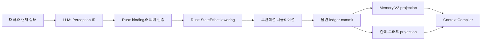

# Mnemosyne Memory Compiler V2 구현 계획

- 작성일: 2026-07-29
- 상태: Proposed
- 선행 연구: `llm-to-state-compiler-research-2026-07-29.md`
- 전략: Hindsight는 비교 기준과 연구 재료로 사용하되, 제품 런타임은 Rust-native로 독립 구현한다.

## 구현 현황

| Milestone | 상태 | 구현 결과 |
|---|---|---|
| M0 기준선 동결과 측정 장치 | 완료 (2026-07-30) | 11개 starter golden case, patch byte-level replay 결정론 검사, accepted/rejected 및 effect 종류별 기대값 검사 |
| M1 V1 권한 경계 즉시 강화 | 완료 (2026-07-30) | engine-only truth 차단, source address 강제 덮어쓰기, scene evidence 의무화, compiler version trace |
| M2 Compiler 경계와 공통 자료형 | 완료 (2026-07-30) | 순수 `compiler/` 모듈, LLM draft/engine-sealed artifact 분리, 단계별 trait, source/candidate/effect 결정론적 provenance |
| M3 Perception IR V2와 shadow 실행 | 완료 (2026-07-30) | V2 JSON schema/prompt, 개발 모드 이중 실행, 무커밋 비교 trace |
| M4 Semantic compiler | 완료 (2026-07-30) | bind/semantic/lower/simulate와 V1 ledger adapter |
| M5 점진 전환 | 완료 (조건부 cutover) | profile opt-in, V2 commit, Form V1 rollback과 fallback trace; 기본값 전환은 live gate 대기 |
| M6 Memory V2 | 완료 (2026-07-30) | raw/derived projection, rebuild equivalence, stale invalidation |
| M7 Consolidation | 완료 (2026-07-30) | topical/evidence/contradiction 기반 deterministic consolidation |
| M8 Hybrid recall | 완료 (2026-07-30) | FTS5/filter/optional semantic/temporal/graph와 context bundle |
| M9 UI/정리 | 완료 (조건부 legacy 유지) | State Map inspector, correction event, 비교 ADR; V1 삭제는 fallback gate 대기 |

## 1. 목표

현재 Evaluator가 LLM의 구조화 출력에서 곧바로 상태 변경 명령을 받는 구조를 다음 구조로 교체한다.



LLM은 인간 언어의 해석만 담당한다. 출처 신원, 진실 등급, 실제 상태 변화량,
분기 유효성, 최종 커밋 권한은 코드가 소유한다.

## 2. 반드시 지킬 불변 조건

1. 기존 저장 데이터와 세션을 계속 읽을 수 있어야 한다.
2. 전환 기간에는 V1이 정상 경로이며 V2 shadow 결과는 상태를 변경하지 않는다.
3. 원장(ledger)이 유일한 정본이다. 기억, 그래프, 벡터 인덱스는 언제든 재구축할 수 있는 projection이다.
4. 프로덕션 turn당 구조화 LLM 호출은 한 번을 기본으로 한다.
5. LLM이 message ID, branch ID, engine truth, 시스템 이벤트를 위조할 수 없어야 한다.
6. 모든 장기 상태 변화는 원문 evidence와 compiler/model/schema version을 추적할 수 있어야 한다.
7. 각 단계는 독립적으로 활성화하거나 되돌릴 수 있어야 한다.

## 3. 범위

### 이번 계획에 포함

- Evaluator 권한 축소
- Perception IR V2
- 결정론적 Rust semantic compiler
- 안전한 V1/V2 전환
- 원시 기억과 파생 기억의 분리
- 근거 기반 consolidation
- 로컬 hybrid recall
- Context Compiler 연동
- 비교 벤치마크와 replay 검증

### 뒤로 미룸

- State Map/뉴럴 맵의 대규모 시각화
- 외부 graph DB 또는 Python memory server 의존
- 기억 자동 편집 UI
- 다중 기기 동기화

시각화는 시스템의 정합성과 correction/invalidation 경로가 완성된 뒤 projection을
보여주는 얇은 UI로 만든다.

## 4. 단계별 실행 계획

## M0. 기준선 동결과 측정 장치

### 작업

- 대표 RP turn을 golden corpus로 고정한다.
- 행동/발언 구분, 거짓말, 전문, 간접 목격, 부정문, 조건문, 회상, retcon,
  object 이동, 관계 repair/betrayal, 사용자 메타 명령을 포함한다.
- 각 turn에 기대하는 perception, effect, rejection reason을 기록한다.
- 현재 V1 결과, ledger hash, 최종 state hash, latency, token 사용량을 기록한다.
- paraphrase, negation, actor swap, perceiver swap, direct-to-hearsay 변환을 자동 생성하는
  metamorphic test 틀을 만든다.

### 산출물

- `state_engine` golden fixtures
- compiler benchmark runner
- V1 기준 보고서

현재 starter corpus:

- `state_engine/tests/fixtures/evaluator_structured_v1_golden.json`
- `state_engine/tests/evaluator_structured_golden.rs`

초기 corpus는 정상 world/scene/object/relationship/memory, 전언, OOC와 함께 evidence
조작, engine truth 승격, source message 위조, 부분 승인을 포함한다. M2 이후
Perception IR 기대값과 actor/perceiver/negation/retcon 사례를 같은 corpus versioning
규칙으로 확장한다.

### 통과 조건

- 현재 테스트와 대표 세션 replay가 재현된다.
- 같은 입력과 compiler version에서 state hash가 항상 같다.
- 이후 단계의 개선/퇴행을 수치로 비교할 수 있다.

## M1. V1 권한 경계 즉시 강화

구조 교체 전에 현재 경로의 위험부터 막는다.

### 작업

- LLM이 낸 engine-only truth status를 semantic validation에서 거부한다.
- `source_message_id`, conversation/branch/turn ID는 LLM 값을 신뢰하지 않고
  실행 컨텍스트에서 주입한다.
- durable op의 evidence 존재와 원문 일치를 검증한다.
- compiler/model/schema version과 rejection diagnostics를 ledger trace에 남긴다.
- 기존 V1 JSON은 읽되, 위험한 필드는 무시하거나 거부하여 호환성을 유지한다.

### 통과 조건

- 조작된 출력으로 engine truth 승격이나 source spoofing이 불가능하다.
- 기존 정상 V1 fixture의 의미 결과에는 의도하지 않은 변화가 없다.
- 실패한 candidate는 이유와 원문 위치를 설명할 수 있다.

### 롤백

DB 파괴적 변경 없이 validator/lowering 단위로 되돌릴 수 있게 유지한다.

## M2. Compiler 경계와 공통 자료형

### 구현 결과 (2026-07-30)

- `PerceptionBatchDraft`와 `PerceptionBatch`를 분리했다.
  - Draft: LLM이 작성 가능한 perception 내용만 포함
  - Batch: Rust가 source hash, candidate ID, compiler/model provenance를 봉인
- `SourceEnvelope`는 생성 시 conversation/branch/turn/message/variant/state/text를
  canonical hash로 묶고, archive 역직렬화 후에도 변조 여부를 재검증한다.
- candidate ID와 effect ID는 source에 결박된 결정론적 artifact ID다.
- 다른 source에서 만든 effect를 transaction에 섞으면 거부한다.
- binding, semantic analysis, lowering, transaction simulation은 trait와 report
  계약만 먼저 고정했으며 아직 기존 V1 commit 경로에는 연결하지 않았다.
- LLM draft에 source/message/branch/truth/effect/state delta 필드를 추가하면
  `deny_unknown_fields`에서 거부된다.

구현 ADR: `memory-compiler-v2-contract-2026-07-30.md`

### 목표 구조

```text
src-tauri/state_engine/src/compiler/
|-- source.rs        코드가 만드는 SourceEnvelope
|-- perception.rs    LLM 출력 PerceptionCandidate
|-- bind.rs          인물·사물·장소 identity binding
|-- semantic.rs      증거·인식론·시간·분기 검증
|-- lower.rs         검증된 candidate -> StateEffect
|-- simulate.rs      patch 충돌과 불변식 사전 검사
`-- diagnostics.rs   accepted/rejected trace
```

### 주요 계약

- `SourceEnvelope`: conversation, branch, turn, message, variant, active soul,
  parent hash, timestamp. 전부 코드 생성.
- `PerceptionCandidate`: kind, subject/predicate/object, actor/perceiver/targets,
  evidence span, epistemic mode, confidence, temporal expression, durability hint.
- `StateEffect`: world event, object observation, episodic memory, belief memory,
  intention, relationship evidence, scene projection.
- 각 artifact는 schema/compiler/model version과 source hash를 가진다.

### 통과 조건

- compiler crate 경계는 Tauri와 SQLite에 의존하지 않는다.
- 모든 자료형에 round-trip serialization test가 있다.
- 동일 IR의 lowering 결과가 결정론적이다.

## M3. Perception IR V2와 shadow 실행

### 작업

- `evaluator_structured_v2` schema와 prompt를 만든다.
- LLM은 effect 명령 대신 아래 관찰 후보만 출력한다.
  - Event
  - Utterance
  - ObjectObservation
  - AffectCue
  - RelationshipEvidence
  - Intention
  - BeliefExpression
  - Correction
- 인식론 유형을 `DirectlyObserved`, `StatedBy`, `NarratorDescribed`,
  `Inferred`, `RememberedBy`로 명시한다.
- 개발/벤치마크 모드에서만 V1과 V2를 동시에 실행한다.
- V2는 parse, bind, validate, lower까지만 수행하고 절대 commit하지 않는다.
- compiler run과 candidate diagnostics를 additive DB table에 저장한다.

### 비용 원칙

shadow의 이중 호출은 개발 벤치마크에서만 허용한다. 실제 사용자 세션에는 기본으로
켜지 않는다. 전환 후에는 V2 한 번만 호출한다.

### 통과 조건

- 안전성 corpus에서 허용되지 않은 effect가 0건이다.
- durable event 누락률, evidence grounding, entity binding이 V1 기준선보다 나쁘지 않다.
- divergence를 candidate 단위로 설명할 수 있다.

## M4. 결정론적 semantic compiler 완성

### 작업

1. entity binder
2. evidence span validator
3. epistemic authority rules
4. temporal anchor resolver
5. branch/variant validity 검사
6. state effect planner
7. transaction simulator
8. repairable error와 terminal rejection 분리

관계 변화는 LLM이 수치 delta를 정하지 않는다. LLM은 행동 증거의 종류, valence,
directness, stakes, cost, repetition만 제시하고 Rust policy가 내부 축과 변화량으로
매핑한다.

초기에는 새 `StateEffect`를 기존 `EnginePatch`로 낮춰 기존 ledger와 rebuild 경로를
그대로 사용한다.

### 통과 조건

- negation, actor/perceiver swap, hearsay 변환에서 기대 effect가 정확히 바뀐다.
- 동일 입력 replay의 ledger/state hash divergence가 0이다.
- rejected candidate가 부분 커밋을 만들지 않는다.
- targeted repair는 거부된 candidate만 다시 처리하며 중복 effect를 만들지 않는다.

## M5. V2 점진 전환

### 작업

- evaluator profile 또는 conversation 단위 feature flag를 둔다.
- V2 성공 시 V2 patch를 commit하고, 실패 시 정책에 따라 V1 fallback 또는
  no-op/retry를 선택한다.
- fallback 횟수와 원인을 측정한다.
- 기존 저장 데이터는 migration 없이 계속 V1 projection으로 읽는다.
- benchmark와 장시간 수동 RP 세션을 모두 통과한 뒤 기본값을 V2로 바꾼다.

### 전환 게이트

- authority 위반 0건
- replay 비결정성 0건
- V1 대비 장기 사건 회수 품질 비퇴행
- 기존 save/import/export 호환
- 프로덕션 기본 경로가 turn당 구조화 호출 1회

### 롤백

feature flag로 즉시 V1 commit 경로로 복귀한다. V2가 만든 patch도 기존 ledger 형식이므로
사용자 데이터를 되돌리거나 삭제할 필요가 없어야 한다.

## M6. Memory V2 projection

### 데이터 모델

원시 기억:

- Episode
- Testimony
- Perception
- Affect
- Intention

파생 기억:

- Belief
- Schema
- RelationshipModel
- SelfModel
- Reflection

### 작업

- ledger에서 원시 기억을 만드는 append-only projection을 추가한다.
- 파생 기억은 source memory ID, supporting/contradicting evidence, confidence,
  valid/stale 상태, 생성 compiler version을 가진다.
- 현재 `MemoryEntry`는 당분간 compatibility projection으로 유지한다.
- projection drop/rebuild 명령과 rebuild equivalence test를 만든다.
- retcon, branch switch, source invalidation 시 파생 기억을 stale 처리한다.

### 통과 조건

- projection 삭제 후 ledger만으로 동일 결과를 재구축한다.
- 근거 없는 derived memory는 저장할 수 없다.
- inactive branch의 기억이 active context에 섞이지 않는다.

## M7. Consolidation

Hindsight의 retain/reflect 분리와 evidence-backed observation consolidation을
참고하되 독립 구현한다.

### 작업

- `turns_since_consolidation`, 중요도 누적, 모순 발생을 trigger로 사용한다.
- background worker는 raw memory를 수정하지 않고 derived proposal만 만든다.
- Rust가 source coverage, contradiction, 중복, temporal validity를 검사해 승인한다.
- belief/schema/relationship/self model 각각에 merge와 invalidation policy를 둔다.
- consolidation 결과도 compiler run처럼 전 과정을 추적한다.

### 통과 조건

- 모든 reflection에서 근거 원문으로 역추적 가능하다.
- 새 반증이 들어오면 기존 belief가 삭제되지 않고 superseded/stale 상태로 전환된다.
- 동일 원장을 재처리해도 derived memory가 중복 생성되지 않는다.

## M8. 로컬 Hybrid Recall과 Context Compiler

### 구현 순서

1. 기존 SQLite의 exact/FTS5(BM25) 검색
2. branch, time, truth, character, memory type filter
3. 선택적 local embedding adapter
4. SQLite edge table 기반 graph expansion
5. 필요성이 벤치마크로 확인될 때만 PPR 추가

외부 graph DB나 Python 서버를 필수 의존성으로 두지 않는다. embedding backend는 trait
뒤에 두어 교체 가능하게 한다.

Context Compiler에는 원문 덩어리가 아니라 `MemoryEvidenceBundle`을 전달한다.

- selected memories
- source snippets
- truth/epistemic status
- temporal scope
- relationship/causal neighbors
- selection reason과 score trace

### 통과 조건

- retrieval 결과마다 선택 이유가 남는다.
- 장기 회상 benchmark에서 현재 context compiler보다 정확도 또는 token 효율이 개선된다.
- vector/graph projection이 없어도 기본 검색과 앱이 정상 동작한다.

## M9. 정리와 UI 연결

### 작업

- V1 fallback 사용이 충분히 사라진 뒤 legacy evaluator 코드를 제거한다.
- compiler lifecycle이 독립된 시점에만 남은 chat pipeline을 추가 분리한다.
- State Map은 정본 편집기가 아니라 memory/evidence/projection 탐색기로 연결한다.
- correction은 projection 직접 수정이 아니라 새 correction event를 ledger에 추가한다.
- Hindsight와 Cognee 비교 벤치마크 결과와 채택/비채택 결정을 ADR로 남긴다.

## 5. Hindsight 사용 경계

Hindsight는 다음 용도로만 사용한다.

- 동일 기억 corpus에 대한 retain/recall/reflect 품질 비교
- observation/belief consolidation 정책 연구
- 장기 기억 benchmark 항목 설계
- 실패 사례와 운영 지표 참고

다음은 하지 않는다.

- 제품에 Hindsight 서버를 필수로 포함
- Python/Postgres/pgvector를 Mnemosyne 정본으로 사용
- Hindsight의 데이터 모델을 그대로 복제
- 라이브 사용자 데이터를 외부 비교 서버로 자동 전송

필요하면 별도 개발 harness에서만 명시적으로 동일한 공개/합성 corpus를 양쪽에 넣어
비교한다.

## 6. 실제 작업 순서

한 번에 한 milestone만 진행한다.

1. **M0** golden corpus와 benchmark runner
2. **M1** 현재 V1 권한 취약점 차단
3. **M2** compiler 자료형과 module 경계
4. **M3** V2 shadow
5. **M4** semantic compiler
6. **M5** 제한적 cutover
7. **M6** Memory V2
8. **M7** consolidation
9. **M8** recall/context
10. **M9** legacy 제거와 State Map 연결

M0, M1, M2는 완료됐다. 다음 구현 단위는 **M3 V2 shadow**다. V2는 parse, bind,
lower와 비교 trace까지만 수행하고, M5 전환 게이트 전에는 ledger를 변경하지 않는다.

## 7. 완료 정의

이 계획은 다음이 모두 만족될 때 끝난다.

- LLM은 perception/claim만 생성하며 상태 변경 권한이 없다.
- 모든 장기 기억과 상태 변화가 source evidence로 역추적된다.
- ledger replay가 결정론적이다.
- raw memory와 derived memory가 분리되고 파생 정보는 무효화/재구축 가능하다.
- 장기 recall이 lexical, semantic, temporal, graph 신호를 필요에 따라 결합한다.
- Hindsight 없이도 전체 앱이 로컬에서 동작한다.
- State Map이 예쁜 그래프가 아니라 검증·수정 가능한 기억 시스템의 창으로 기능한다.
